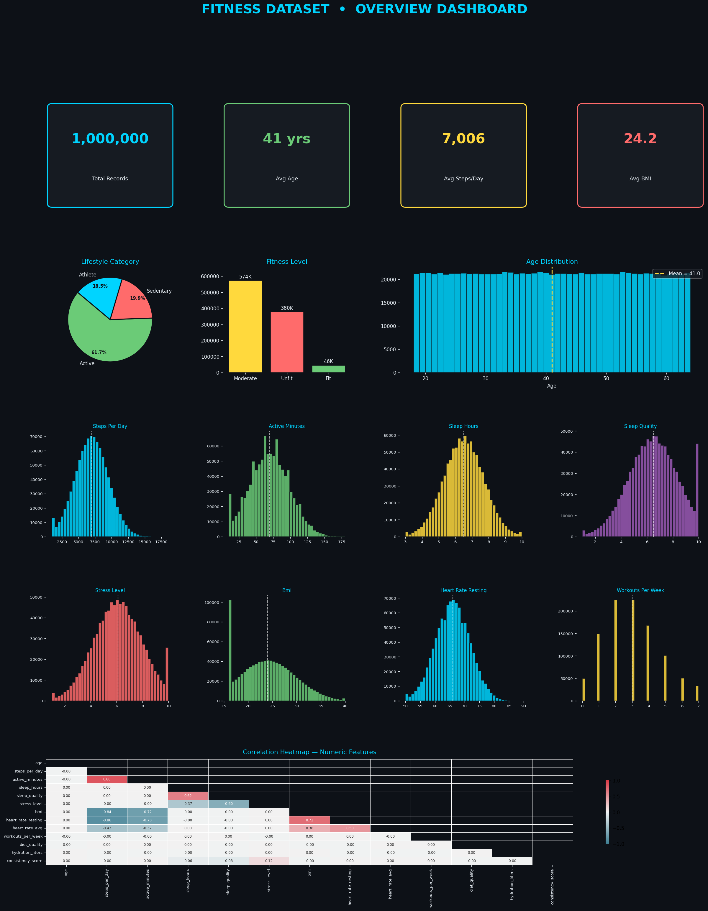
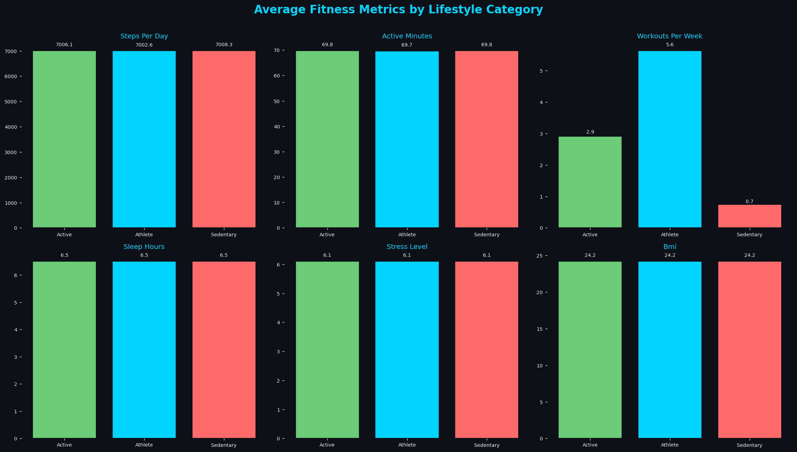
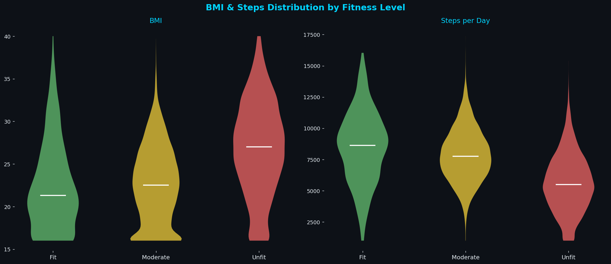
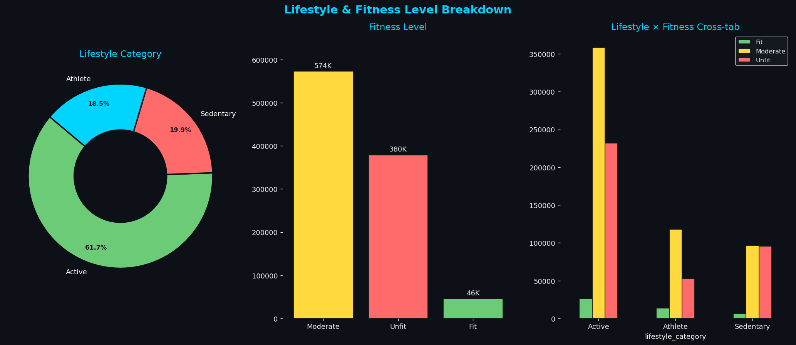
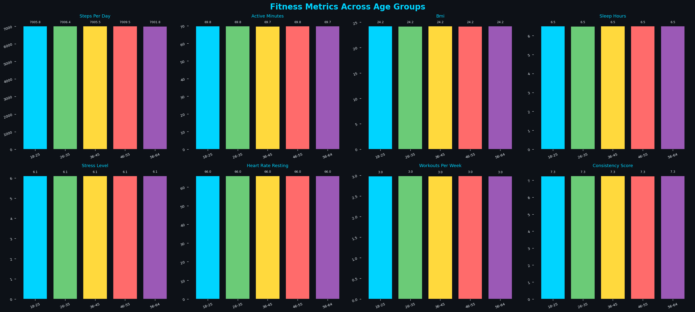
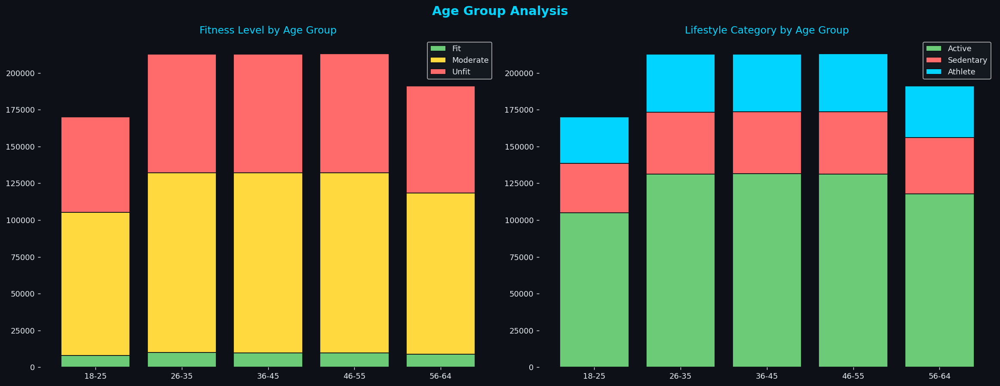
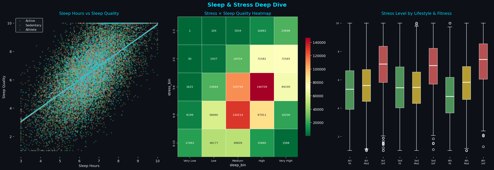
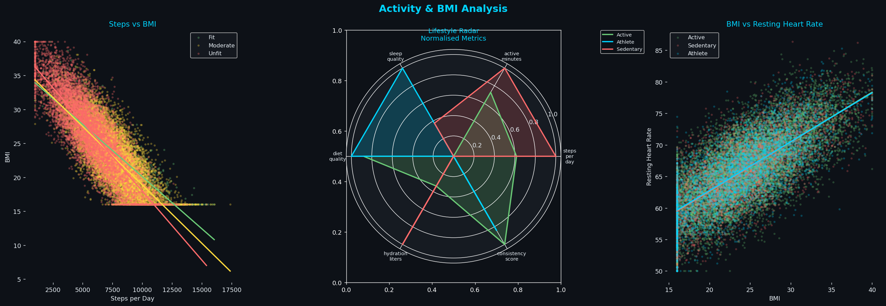
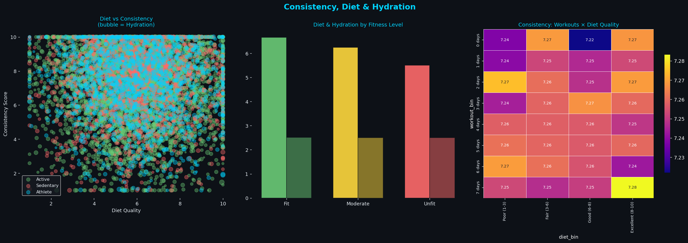
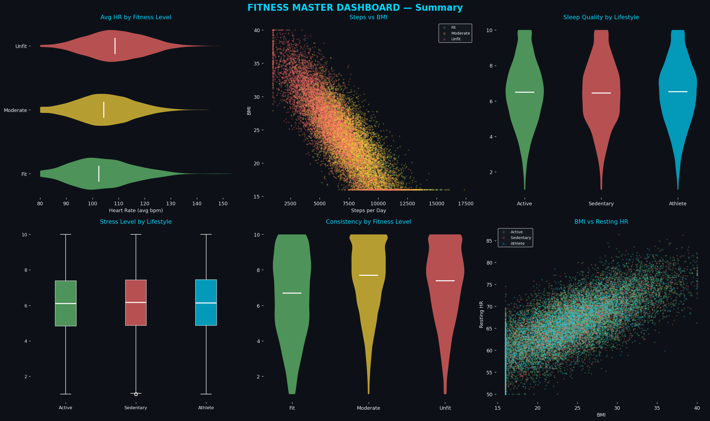

# Fitness Dataset — Interactive Exploratory Data Analysis

> A comprehensive Python EDA project analysing **1,000,000 fitness records** across 17 health and activity variables, producing 20 interactive charts and dashboards using `matplotlib`, `seaborn`, and `plotly`.

---

## Project Description

This project performs a full exploratory data analysis on a large-scale fitness dataset containing one million anonymised health records. Each record captures a broad range of physical and behavioural health markers — from daily step counts and resting heart rate to sleep quality, stress levels, diet scores, and workout frequency — alongside categorical labels for `lifestyle_category` (Active, Sedentary, Athlete) and `fitness_level` (Fit, Moderate, Unfit).

The analysis is structured into **8 thematic sections**, each targeting a different dimension of the data. Charts are displayed one by one in sequence: Plotly charts open interactively in the default browser (with full hover, zoom, pan, and 3D rotation), while the matplotlib overview dashboard opens as a GUI window. The user advances through charts by pressing Enter in the terminal, allowing as much time as needed on each visualisation.

Key questions explored include: How does physical activity relate to BMI? Does sleep quality deteriorate under stress? Do diet and hydration habits differ meaningfully across fitness levels? Are there measurable differences in health metrics across age groups? The findings reveal that **daily step count is the single strongest predictor of BMI** (r = −0.844), that **stress and sleep quality are tightly inversely linked** (r = −0.596), and that the `fitness_level` column captures far sharper behavioural differences than the broader `lifestyle_category` label.

---

## Chart Gallery

### Chart 1 — Overview Dashboard

_KPI cards · Lifestyle pie · Fitness level bar · Age histogram · 8 feature distributions · Correlation heatmap_



---

### Chart 2 — Avg Fitness Metrics by Lifestyle Category

_Grouped bar chart across 6 metrics: steps, active minutes, workouts, sleep, stress, BMI_



---

### Chart 3 — BMI & Steps Distribution by Fitness Level

_Side-by-side violin plots showing distributional shape, quartiles, and mean_



---

### Chart 4 — Lifestyle & Fitness Level Breakdown

_Donut chart · Fitness level bar · Cross-tabulation of lifestyle × fitness_



---

### Chart 5 — Fitness Metrics Across Age Groups

_8-panel bar chart covering all key metrics segmented by age band (18–64)_



---

### Chart 6 — Age Group Stacked Bar Analysis

_Stacked bars showing fitness level and lifestyle composition within each age group_



---

### Chart 7 — Sleep & Stress Deep Dive

_Scatter with OLS trendlines · Count heatmap (stress × sleep bins) · Box plot by lifestyle & fitness_



---

### Chart 8 — Activity, BMI & Radar Profile

_Steps vs BMI scatter · Normalised radar chart per lifestyle · BMI vs resting heart rate_



---

### Chart 9 — Consistency, Diet & Hydration

_Bubble chart (diet × consistency, bubble = hydration) · Diet & hydration bar · Workout × diet consistency heatmap_



---

### Chart 10 — Interactive Master Dashboard

_9-panel summary: avg HR violin · Steps vs BMI · Sleep quality · Stress box · Consistency · BMI vs resting HR_



---

## Dataset Overview

| Property            | Value                                     |
| ------------------- | ----------------------------------------- |
| Total Records       | 1,000,000                                 |
| Features            | 17                                        |
| Missing Values      | None                                      |
| Numeric Columns     | 15                                        |
| Categorical Columns | 2 (`lifestyle_category`, `fitness_level`) |

### Columns

| Column               | Type  | Description                              |
| -------------------- | ----- | ---------------------------------------- |
| `age`                | int   | Age of the individual (18–64)            |
| `lifestyle_category` | str   | Active / Sedentary / Athlete             |
| `fitness_level`      | str   | Fit / Moderate / Unfit                   |
| `steps_per_day`      | int   | Average daily step count                 |
| `active_minutes`     | int   | Daily active minutes                     |
| `sleep_hours`        | float | Average nightly sleep duration           |
| `sleep_quality`      | float | Self-reported sleep quality score (1–10) |
| `stress_level`       | float | Self-reported stress score (1–10)        |
| `bmi`                | float | Body Mass Index                          |
| `heart_rate_resting` | int   | Resting heart rate (bpm)                 |
| `heart_rate_avg`     | int   | Average heart rate (bpm)                 |
| `workouts_per_week`  | int   | Number of workout sessions per week      |
| `diet_quality`       | float | Diet quality score (1–10)                |
| `hydration_liters`   | float | Daily water intake in litres             |
| `consistency_score`  | float | Behavioural consistency score            |

---

## Key Findings

- **Steps ↔ BMI (r = −0.844):** The strongest signal in the dataset. More steps consistently means lower BMI, regardless of lifestyle label.
- **Stress ↔ Sleep Quality (r = −0.596):** Higher stress reliably degrades sleep quality across all groups.
- **Fit vs Unfit:** Fit individuals average 8,436 steps/day and BMI 22.3; Unfit individuals average 5,578 steps/day and BMI 26.9.
- **Heart Rate:** Fit individuals have a resting HR of ~63 bpm vs ~69 bpm for Unfit — a clinically meaningful gap.
- **Age is neutral:** Fitness metrics are nearly uniform across all five age bands, suggesting balanced sampling or synthetic data.
- **Diet + workouts compound:** High workout frequency combined with high diet quality produces the highest consistency scores in the dataset.

---

## Tech Stack

| Library       | Version | Purpose                                   |
| ------------- | ------- | ----------------------------------------- |
| `pandas`      | ≥ 1.5   | Data loading, grouping, aggregation       |
| `numpy`       | ≥ 1.23  | Numerical operations, masking             |
| `matplotlib`  | ≥ 3.6   | Static overview dashboard                 |
| `seaborn`     | ≥ 0.12  | Correlation heatmap, statistical heatmaps |
| `plotly`      | ≥ 5.13  | All interactive charts (browser-based)    |
| `statsmodels` | ≥ 0.13  | OLS trendlines in scatter plots           |

---

## Getting Started

### 1. Install dependencies

```bash
pip install pandas numpy matplotlib seaborn plotly statsmodels
```

### 2. Place your dataset

Put `1779623154544_fitness_dataset.csv` in the same folder as the script, or update the path at line 47:

```python
df = pd.read_csv("your_path/fitness_dataset.csv")
```

### 3. Run

```bash
python fitness_eda_interactive.py
```

Charts open one by one. **Press Enter** in the terminal to advance to the next chart.

---

## Project Structure

```
fitness-eda/
├── fitness_eda_interactive.py   ← Main script
├── fitness_dataset.csv          ← Dataset (1M rows)
└── README.md                    ← This file
```

---

## Chart Display Logic

| Chart Type                      | Renderer           | How it Opens      |
| ------------------------------- | ------------------ | ----------------- |
| Overview Dashboard (Section A)  | `matplotlib`       | Native GUI window |
| All other charts (Sections B–H) | `plotly` (browser) | New browser tab   |

Advancement between charts is controlled by `input()` in the terminal — the script pauses after each `fig.show()` call and waits for Enter before building the next figure.

---

## License

This project is released for educational and analytical use. The dataset is synthetic and contains no real personal health information.
